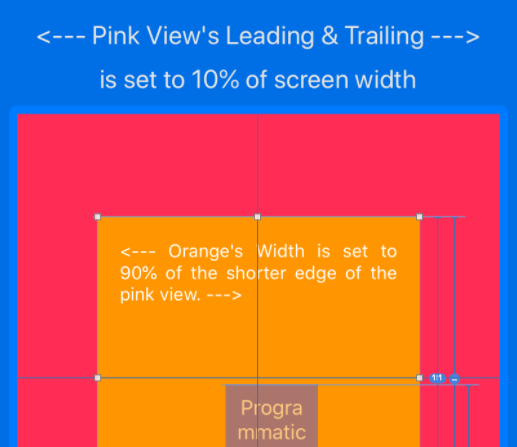
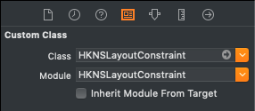
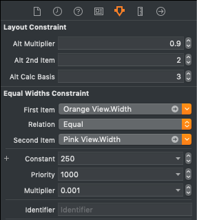

#  HKNSLayoutConstraint #
    
#### Harrison Kong's Enhanced NSLayoutConstraint ####




## VERSION HISTORY ##

1.0.0 - 2020/02/17 - Initial release

## MINIMUM REQUIREMENTS ##

**Swift** 4.2 or above

**iOS** 8.0 or above


## WHAT IS IT? ##
`HKNSLayoutConstraint` enhances the functionality of `NSLayoutConstraint` by providing these additional features:


## HOW TO INSTALL IT ##

Use one of the following methods:

### 1. Using CocoaPod ###

The module is avabilable via CocoaPods Trunk. Below is an example podfile. If you already use a podfile for your project, all you have to do is add the line that specifies `HKNSLayoutConstraint`. The other dependencies will also be automatically installed in the xcworkspace.

```
platform :ios, '8.0'

target 'MyTarget' do

  use_frameworks!

  pod 'HKNSLayoutConstraint', '~> 1.0.0'
  # other pods for your project

end

```

Don't forget to import the module in your source code:

```
import HKNSLayoutConstraint
```

### 2. BY INCLUDING THE SOURCE FILES ###

You can also simply include the following source files in your project:

```
HKDeviceUtilities.swift
HKNSLayoutConstraint.swift
```


## HOW TO USE IT ##

### About the Equation ###

One important thing to remember is that this custom class only manipulates the **constant** of the layout equation using the alt 2nd item, alt multipler and alt calc basis.

Remember the layout constraint equation for `NSLayoutConstraint` is:

  `first-item.attribute = second-item.attribute x multiplier + constant`

This custom class uses 3 additional parameters to change the constant as follow:

  `first-item.attribute = second-item.attribute x multiplier + ( alt-2nd-item.alt-calc-basis x alt-multipler )`

This means that: for dimension type constraints (i.e., width, height), if the original multiplier (the one used by the base class, **NOT** alt multiplier) is not set to a very small number (e.g. 0.0001), it will influent the final result, unless of course, that is what you intended.

This also means that: for X-axis and Y-axis type constraints (e.g. leading anchor, trailing anchor), if the original multiplier is not set to 1.0, the result is probably not what you want.

(If you construct the custom class programmatically using two of the convenient initializers instead of using Interface Builder, this will be automatically taken care of for you.)

### Interface Builder ###

1. Create an ordinary 2-item layout constraint then change the class in the *Identity Inspector* pane to HKNSLayoutConstraint like this:



2. There will be 3 inspectable variables at the *Attribute Inspector* pane:



  - the 1st one **Alt Multiplier** is the alternative multiplier in the above equation, it is a CGFloat.
  
  - the 2nd attribute **Alt 2nd Item** is:
  
        1 = notAnItem, this is used when you just want to use the constant instead of calculation
        2 = deviceScreen, the dimension of the screen of the device
        3 = uiItem(UIView?), another descendent of UIView, note that if you use this option in Interface Builder, you must set the value of the UIView in the code because it is not possible to do this in Interface Builder. See Programmatically below.
  
  - the 3rd attribute **Alt Calc Basis** is an integer that corresponds to the following:

        1 = width of the alt 2nd item (unless it is notAnItem, then this is ignored)
        2 = height of the alt 2nd item (unless it is notAnItem, then this is ignored)
        3 = shorter edge (width or height) of the alt 2nd item (unless it is notAnItem, then this is ignored)
        4 = longer edge (width of height) of the alt 2nd item (unless it is notAnItem, then this is ignored)
        5 = no calculation, set to the original constant
        
        If this is set to any number less than 1, it will be assumed to be 1
        If this is set to any number greater than 5, it will be assumed to be 5
    
3. Note that the actually layout will **NOT** be displayed at design time.

4  **Important** : You must call the custom class method `viewWillLayoutSubviews()` in the same overridden method in the view controller if your app support device rotations in order to recalculate all the constraints.

### Programmatically ###

Create an instance of the class and then set the attributes (see Interface Builder above for explanations of the attributes)

```
override func viewDidLoad() {

  super.viewDidLoad()
  
  // set width of viewA to 0.5 of the viewB:
        
  viewAWidthConstraint = HKNSLayoutConstraint(item: viewA as Any, attribute: .width, altSecondItem: .uiItem(viewB),         altCalculationBasis: .width, altMultiplier: 0.5)

  viewAWidthConstraint.isActive = true
        
  // set height of viewA to a constant of 40:
        
  viewAHeightConstraint = HKNSLayoutConstraint(item: viewA as Any, attribute: .height, altSecondItem: .notAnItem,           altCalculationBasis: .constant, constant: 40.0)

  viewAHeightConstraint.isActive = true
}

override func viewWillLayoutSubviews() {
  viewAWidthConstraint.viewWillLayoutSubviews()
  viewAHeightConstraint.viewWillLayoutSubviews() // not necessary but in case the equation is changed later
  
}

```

Note that the attributes `Alt Calc Basis` is of enumeration type that is declared inc`UIView+LengthCalculationBasis.swift` as follow:

```
@objc public enum LengthCalculationBasis: Int {
   case width = 1
   case height
   case shorterEdge
   case longerEdge
   case constant
}
```


## KNOWN ISSUES ##

There are no known issues currently.

